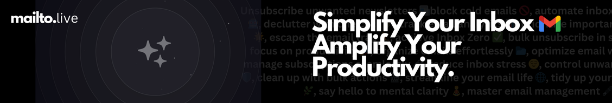

## **Getting Started**

Get started with Mailto Live

<CardGroup cols={2}>
  <Card title="AI Personal Assistant" icon="wand-magic-sparkles" href="https://mintlify.com/docs/settings/global">
    [Your AI personal email assistant that manages your inbox for you](https://docs.getinboxzero.com/essentials/email-ai-personal-assistant)
  </Card>

  <Card title="Bulk Unsubscriber" icon="envelope-circle-check" href="https://mintlify.com/docs/api-playground/openapi">
    [Bulk unsubscribe from newsletter and marketing emails in one-click](https://docs.getinboxzero.com/essentials/bulk-email-unsubscriber)
  </Card>

  <Card title="Smart Categories" icon="screwdriver-wrench" href="https://mintlify.com/docs/components/accordion">
    [Automatically categorize your emails into smart categories using AI](https://docs.getinboxzero.com/essentials/smart-categories)
  </Card>

  <Card title="Cold Email Blocker" icon="shield-halved" href="https://mintlify.com/customers">
    [Block cold emails and protect your inbox from spam using AI filters](https://docs.getinboxzero.com/essentials/cold-email-blocker)
  </Card>
</CardGroup>

<CardGroup cols={2}>
  <Card title="Analytics" icon="chart-simple" href="https://mintlify.com/docs/settings/global">
    [[Understand where you’re spending your time and what is filling up your inbox with our detailed analytics](https://docs.getinboxzero.com/essentials/email-analytics)](https://docs.getinboxzero.com/essentials/email-ai-personal-assistant)
  </Card>

  <Card title="FAQ" icon="envelope-circle-check" href="https://mintlify.com/docs/api-playground/openapi">
    [[## FAQ](https://docs.getinboxzero.com/essentials/faq)](https://docs.getinboxzero.com/essentials/bulk-email-unsubscriber)
  </Card>

  <Card title="New Senders" icon="user-plus" href="https://mintlify.com/docs/components/accordion">
    [[Keep track of new addresses that have emailed you this week](https://docs.getinboxzero.com/essentials/new-senders)](https://docs.getinboxzero.com/essentials/smart-categories)
  </Card>

  <Card title="Email Client" icon="envelope" href="https://mintlify.com/customers">
    [[The Inbox Zero email client](https://docs.getinboxzero.com/essentials/mail)](https://docs.getinboxzero.com/essentials/cold-email-blocker)
  </Card>
</CardGroup>